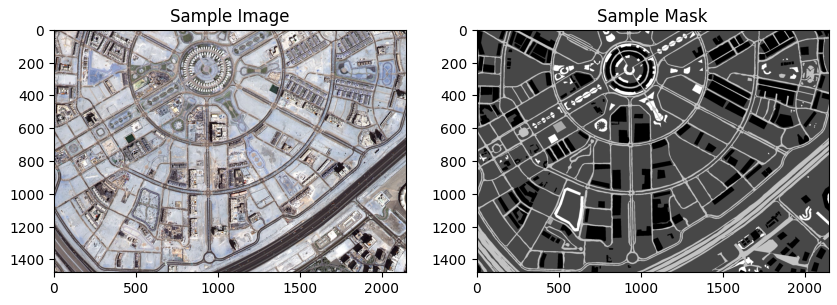
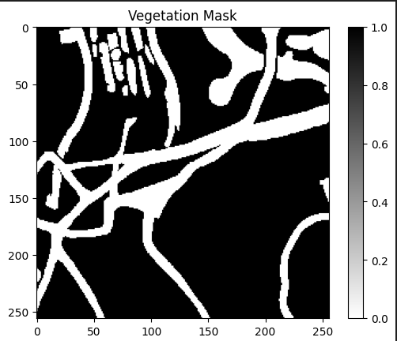

## Exploratory Data Analysis (EDA)

### Dataset Loading

The dataset consists of aerial imagery of Dubai obtained by MBRSC satellites and annotated with pixel-wise semantic segmentation in 6 classes. The total volume of the dataset is 72 images grouped into 6 larger tiles. The images are stored in the "images" folder, and the corresponding masks are stored in the "masks" folder within each tile folder.

To load the dataset, the `load_dataset` function is used. This function iterates through each tile folder, reads the images and masks, and returns two lists: `images` containing the images and `masks` containing the corresponding masks.

### Dataset Visualization

After loading the dataset, a sample image and its corresponding mask are visualized using matplotlib. The sample image is displayed in RGB format, while the mask is displayed in grayscale, where different colors represent different classes:

- Building: #3C1098
- Land (unpaved area): #8429F6
- Road: #6EC1E4
- Vegetation: #FEDD3A
- Water: #E2A929
- Unlabeled: #9B9B9B

The visualization provides an overview of the dataset and helps in understanding the distribution and characteristics of the images and masks.

## Dataset Preprocessing

After preprocessing the dataset, the following files will be created:

- `preprocessed_images.npy`: Contains preprocessed images.
- `preprocessed_masks.npy`: Contains preprocessed masks.

# Sample Vegetation mask:

## Dataset Splitting

After splitting the dataset, the following files will be created:

- `X_train.npy`: Contains training images.
- `y_train.npy`: Contains corresponding training masks.
- `X_val.npy`: Contains validation images.
- `y_val.npy`: Contains corresponding validation masks.
- `X_test.npy`: Contains test images.
- `y_test.npy`: Contains corresponding test masks.
