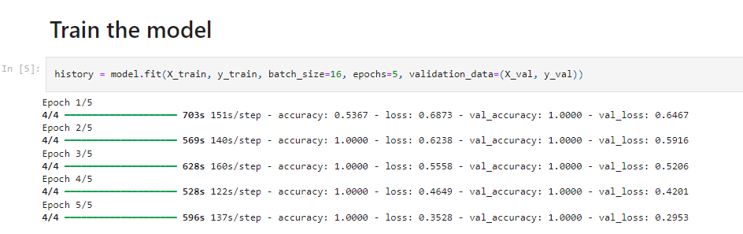

This neural network training script utilizes TensorFlow and Keras libraries for developing and training a U-Net model. The U-Net architecture is commonly used for semantic segmentation tasks, particularly in medical image analysis.

```bash
pip install numpy scikit-learn tensorflow matplotlib
```
# Data 
The data used for training, validation, and testing are loaded from NumPy files (X_train.npy, y_train.npy, X_val.npy, y_val.npy, X_test.npy, y_test.npy). Ensure that these files are correctly located and contain the input images and corresponding labels in the appropriate format.

# Model 
The model used for training is loaded from a pre-trained file (path_to_unet_model.keras). Ensure that this file exists and contains the architecture and weights of the U-Net model.

# Training 
The training process involves compiling the model using the Adam optimizer with a learning rate of 1e-4 and binary cross-entropy loss function. The fit() function is then used to train the model on the training data for 5 epochs with a batch size of 16. Validation data is provided to monitor the model's performance during training.



# Saving the Model 
After training, the trained model is saved to a file named trained_model.keras using the Keras save() function. This file contains the trained weights and architecture of the model for future use.

# Visualization
The training and validation loss curves are plotted using Matplotlib to visualize the training progress. The x-axis represents the number of epochs, while the y-axis represents the corresponding loss values for both training and validation data.


