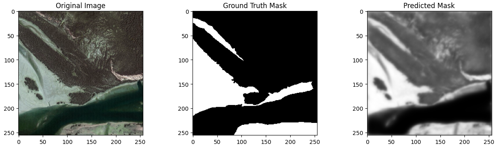
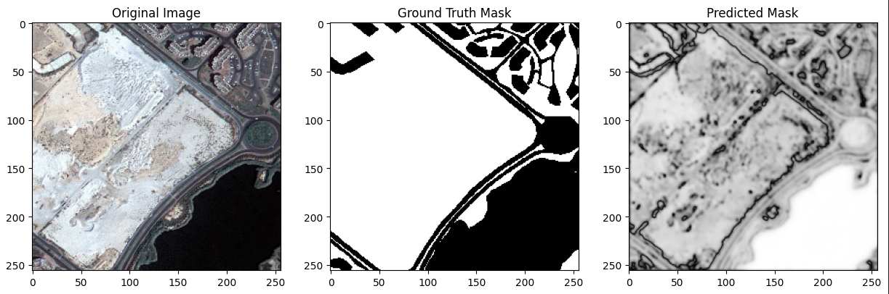
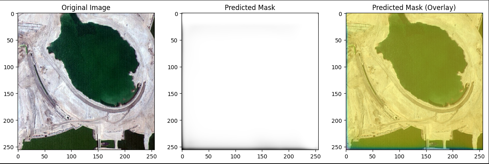
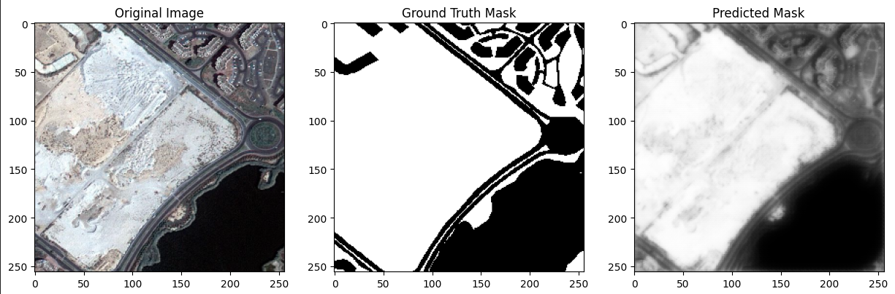
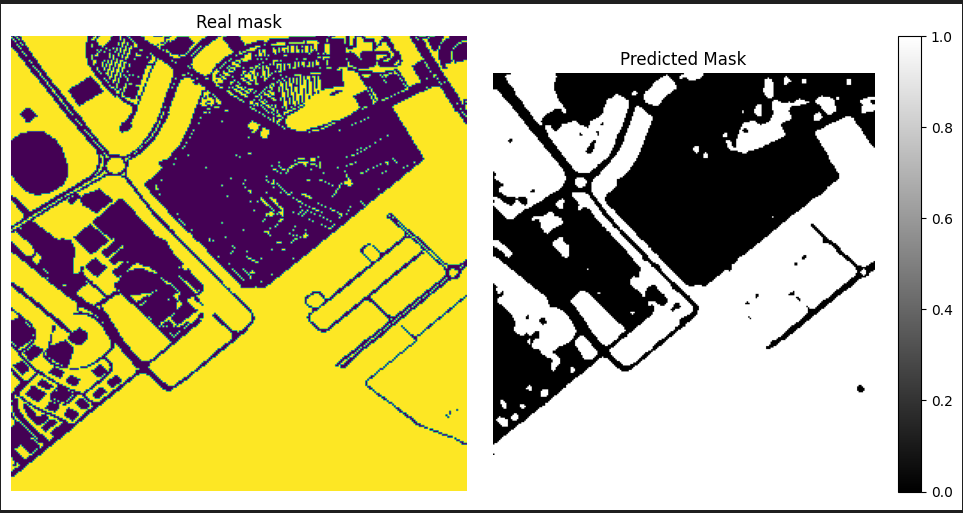

## Description

This repository contains evaluation and prediction results for a semantic segmentation model trained using the UNet, UNet++, Resnet architecture. The model was trained on a dataset of aerial imagery annotated with pixel-wise semantic segmentation labels.

# Evaluation and Prediction (Unet)

## Validation and Test Results

- **Validation Loss**: 0.466
- **Validation Accuracy**: 0.789
- **Test Loss**: 0.335
- **Test Accuracy**: 0.878

## Evaluation

The model's performance was evaluated using both a validation set and a separate test set. The validation loss and accuracy metrics indicate the model's performance on a portion of the dataset not used during training. Similarly, the test loss and accuracy metrics provide an assessment of the model's generalization to unseen data.

## Prediction

Prediction was performed on a randomly selected sample from the test set. The original image, ground truth mask, and predicted mask overlaid on the original image are visualized to demonstrate the model's segmentation performance.

# Evaluation and Prediction (Unet++)

## Validation and Test Results

- **Validation Loss**: 0.443
- **Validation Accuracy**: 0.807
- **Test Loss**: 0.323
- **Test Accuracy**: 0.868

## Evaluation

The model's performance was evaluated using both a validation set and a separate test set. The validation loss and accuracy metrics indicate the model's performance on a portion of the dataset not used during training. Similarly, the test loss and accuracy metrics provide an assessment of the model's generalization to unseen data.

## Prediction

Prediction was performed on a randomly selected sample from the test set. The original image, ground truth mask, and predicted mask overlaid on the original image are visualized to demonstrate the model's segmentation performance.

# Evaluation and Prediction (ResUNet)

## Validation and Test Results (First Step)

- **Validation Loss**: 4.38
- **Validation Accuracy**: 0.34
- **Test Loss**: 3.05
- **Test Accuracy**: 0.59

## Validation and Test Results (Second Step)

- **Validation Loss**: 0.46
- **Validation Accuracy**: 0.79
- **Test Loss**: 0.34
- **Test Accuracy**: 0.88

## Evaluation

The model's performance was evaluated using both a validation set and a separate test set. The validation loss and accuracy metrics indicate the model's performance on a portion of the dataset not used during training. Similarly, the test loss and accuracy metrics provide an assessment of the model's generalization to unseen data.

## Prediction

Prediction was performed on a randomly selected sample from the test set. The original image, ground truth mask, and predicted mask overlaid on the original image are visualized to demonstrate the model's segmentation performance.

### First step sample image

### Second step sample image

# Fusion

## Results:

- Ensamble loss : 0.43
- Ensamble Accuracy : 0.76

